# Dwarf Fortress Domain Research

## Overview

This document contains comprehensive research on Dwarf Fortress game mechanics, models, entities, world generation, logic, and behavior systems. This research serves as the foundation for building a Dwarf Fortress-inspired simulation game.

**Sources:**
- [Dwarf Fortress Wiki](https://dwarffortresswiki.org/)
- [DFHack df-structures Repository](https://github.com/DFHack/df-structures)
- [Stack Overflow - How Dwarf Fortress is Built](https://stackoverflow.blog/2021/12/31/700000-lines-of-code-20-years-and-one-developer-how-dwarf-fortress-is-built/)
- [Bay 12 Games Official Site](https://www.bay12games.com/dwarves/)

---

## Table of Contents

1. [Core Architecture](#1-core-architecture)
2. [World Generation](#2-world-generation)
3. [Unit/Creature System](#3-unitcreature-system)
4. [Attributes System](#4-attributes-system)
5. [Skills & Labor System](#5-skills--labor-system)
6. [Personality & Psychology System](#6-personality--psychology-system)
7. [Needs & Happiness System](#7-needs--happiness-system)
8. [Combat & Anatomy System](#8-combat--anatomy-system)
9. [Item & Material System](#9-item--material-system)
10. [Building & Construction System](#10-building--construction-system)
11. [Job & Task System](#11-job--task-system)
12. [Entity & Civilization System](#12-entity--civilization-system)
13. [Pathfinding System](#13-pathfinding-system)

---

## 1. Core Architecture

### High-Level System Diagram

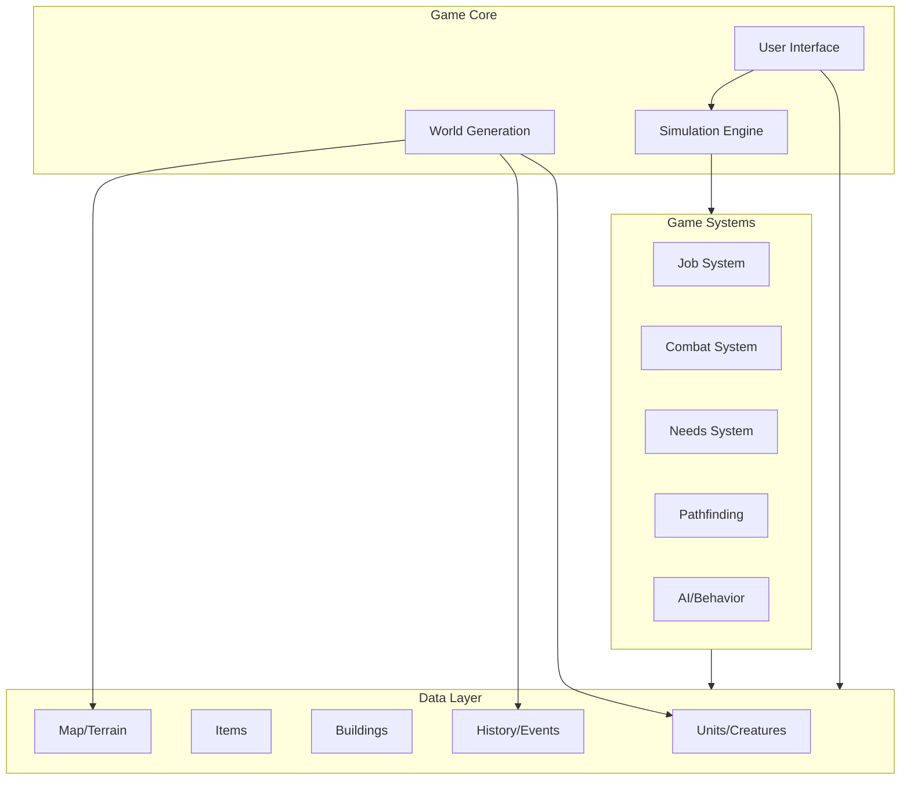

### Key Data Structures (from DFHack)

The game uses several core XML-defined structures:
- `df.unit.xml` - Unit/creature data
- `df.soul.xml` - Personality/soul data
- `df.item.xml` - Item definitions
- `df.job.xml` - Job system
- `df.building.xml` - Building structures
- `df.creature.xml` - Creature definitions
- `df.material.xml` - Material properties

---

## 2. World Generation

### Generation Pipeline

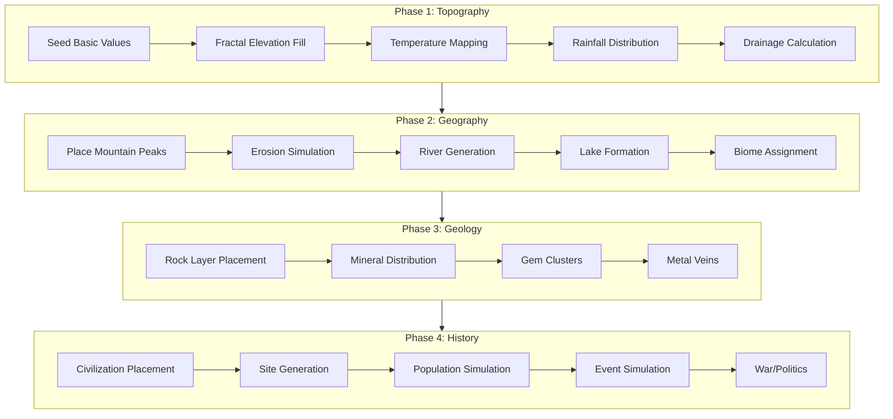

### World Generation Parameters

| Parameter | Options | Description |
|-----------|---------|-------------|
| World Size | 17×17 to 257×257 | Region tile dimensions |
| History Length | 5-1050 years | Simulated history duration |
| Civilizations | Very Low to Very High | Number of civilizations |
| Maximum Sites | Very Low to Very High | Town/hamlet count |
| Number of Beasts | Very Low to Very High | Megabeasts/titans |
| Natural Savagery | Low to High | Aggressive biome frequency |
| Mineral Occurrence | Sparse to Frequent | Resource density |

### Terrain Field Values

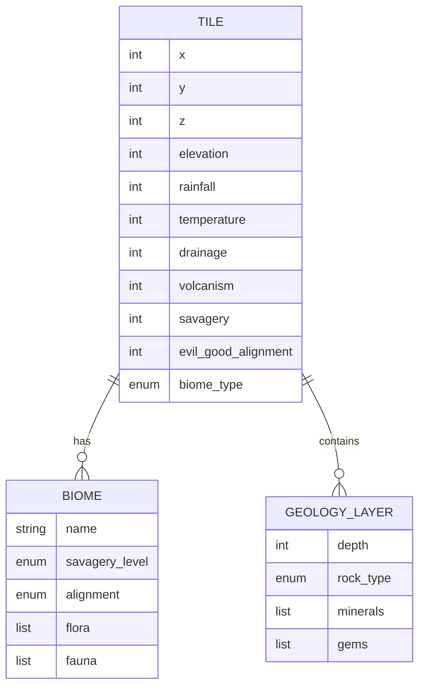

---

## 3. Unit/Creature System

### Unit Data Model

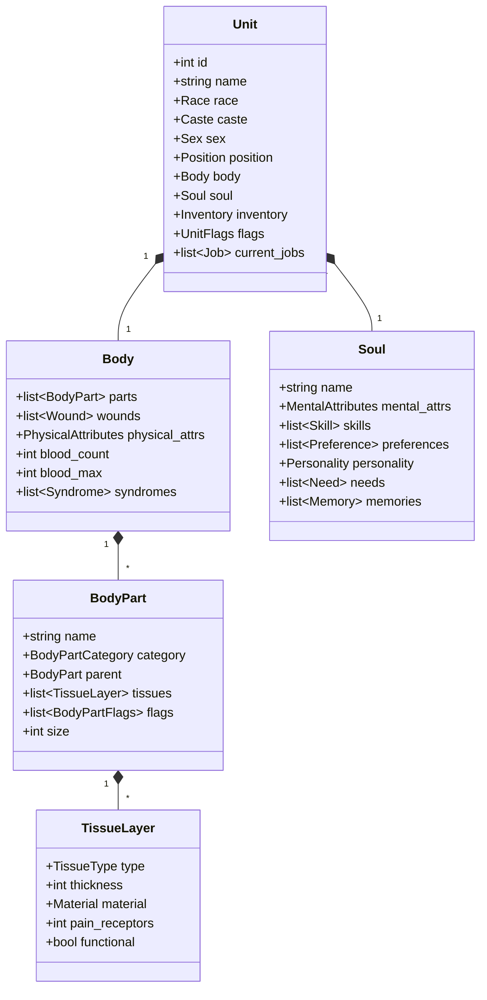

### Unit Action System

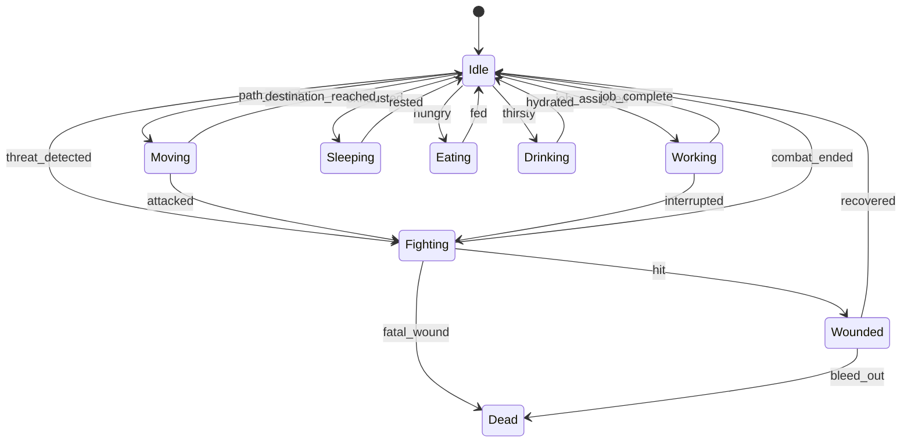

---

## 4. Attributes System

### Physical Attributes

| Attribute | Median | Effects |
|-----------|--------|---------|
| **Strength** | 1250 | Melee damage, carry capacity, muscle mass, running speed |
| **Agility** | 900 | Fast gait speeds, dodge capability |
| **Toughness** | 1250 | Reduces all physical damage, bleeding, suffocation |
| **Endurance** | 1000 | Reduces exhaustion rate, increases pain tolerance |
| **Recuperation** | 1000 | Wound healing speed, fat reduction |
| **Disease Resistance** | 1000 | Syndrome resistance and effect mitigation |

### Mental Attributes

| Attribute | Median | Effects |
|-----------|--------|---------|
| **Analytical Ability** | 1250 | Learning speed for analytical skills |
| **Focus** | 1500 | Task concentration |
| **Willpower** | 1000 | Resistance to exhaustion |
| **Creativity** | 1250 | Artifact creation, artistic quality |
| **Intuition** | 1000 | Instinctive decisions |
| **Patience** | 1250 | Task persistence |
| **Memory** | 1250 | Skill retention |
| **Linguistic Ability** | 1000 | Language learning |
| **Spatial Sense** | 1000 | Navigation, construction |
| **Musicality** | 1000 | Musical performance |
| **Kinesthetic Sense** | 1000 | Physical coordination |
| **Empathy** | 1000 | Social understanding |
| **Social Awareness** | 1000 | Social skill learning |

### Attribute Value Ranges

```mermaid
gantt
    title Attribute Value Distribution (0-5000)
    dateFormat X
    axisFormat %s

    section Levels
    Very Low (0-199)    :a, 0, 200
    Low (200-449)       :b, 200, 450
    Below Avg (450-649) :c, 450, 650
    Average (650-1099)  :d, 650, 1100
    Above Avg (1100-1349) :e, 1100, 1350
    High (1350-1549)    :f, 1350, 1550
    Very High (1550-1999) :g, 1550, 2000
    Superior (2000-2999) :h, 2000, 3000
    Extreme (3000-5000) :i, 3000, 5000
```

---

## 5. Skills & Labor System

### Skill Progression

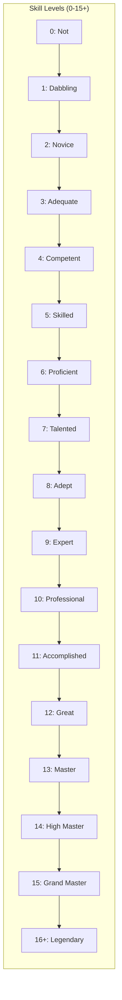

**Experience Formula:** `400 + 100 * new_level` XP per level

### Skill Categories

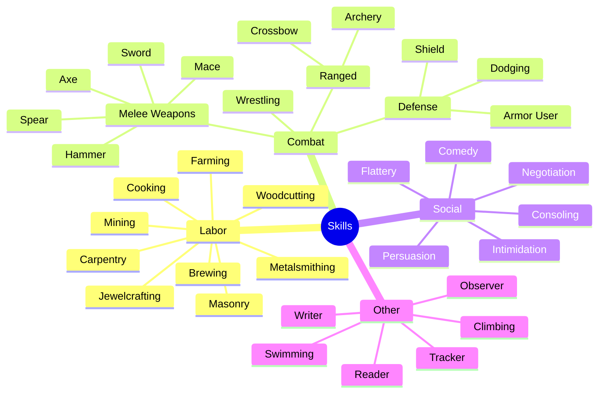

### Labor-Skill-Job Relationship

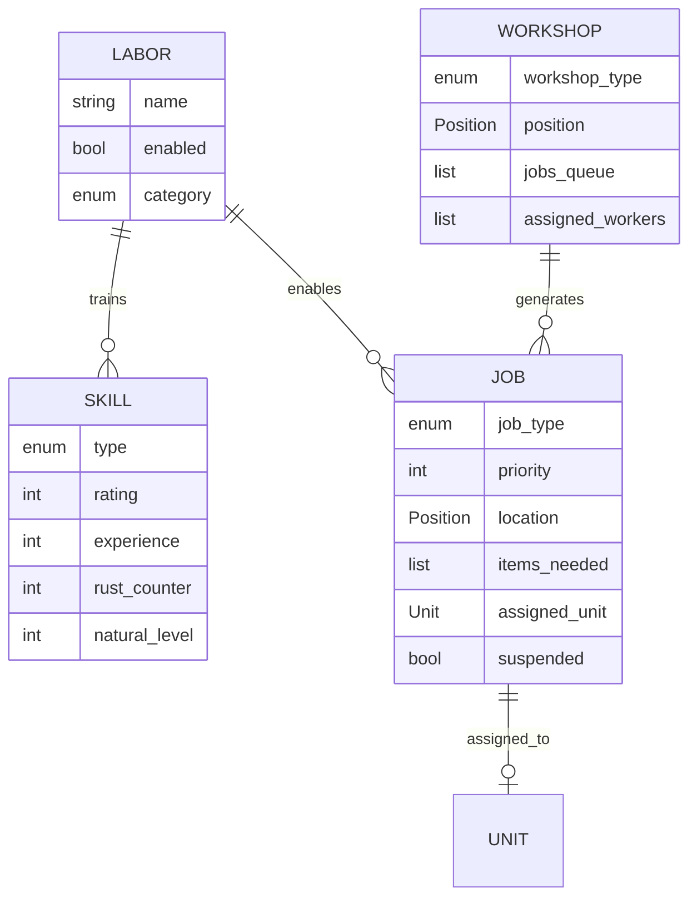

---

## 6. Personality & Psychology System

### Personality Structure

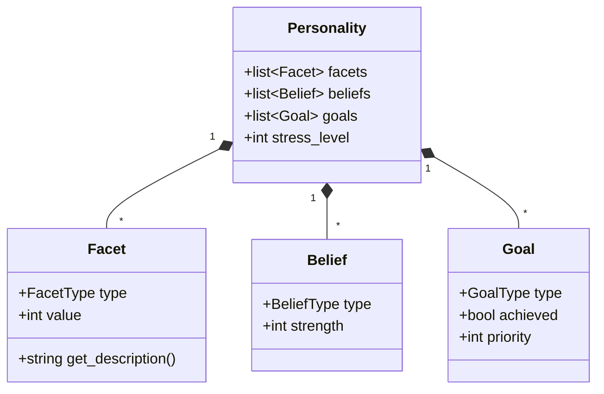

### Personality Facets (Complete List)

#### Emotional Facets
| Facet | Range | Low Description | High Description |
|-------|-------|-----------------|------------------|
| LOVE_PROPENSITY | 0-100 | Never falls in love | Always in love |
| HATE_PROPENSITY | 0-100 | Never feels hatred | Easily develops hatred |
| ENVY_PROPENSITY | 0-100 | Never envies others | Consumed by jealousy |
| CHEER_PROPENSITY | 0-100 | Never cheerful | Often filled with joy |
| DEPRESSION_PROPENSITY | 0-100 | Rarely sad | Prone to depression |
| ANGER_PROPENSITY | 0-100 | Never angry | Constant internal rage |
| ANXIETY_PROPENSITY | 0-100 | Calm and collected | Nervous wreck |

#### Behavioral Facets
| Facet | Range | Low Description | High Description |
|-------|-------|-----------------|------------------|
| STRESS_VULNERABILITY | 0-100 | Stress resistant | Easily overwhelmed |
| GREED | 0-100 | Neglects wealth | Obsessed with wealth |
| IMMODERATION | 0-100 | Never overindulges | Ruled by cravings |
| VIOLENT | 0-100 | Peaceful | Enjoys fighting |
| PERSEVERANCE | 0-100 | Gives up easily | Unbelievably stubborn |
| BRAVERY | 0-100 | Coward | Utterly fearless |
| CONFIDENCE | 0-100 | No confidence | Blind overconfidence |
| AMBITION | 0-100 | No ambition | Relentless drive |

#### Social Facets
| Facet | Range | Low Description | High Description |
|-------|-------|-----------------|------------------|
| FRIENDLINESS | 0-100 | Quarreler | Bold flatterer |
| POLITENESS | 0-100 | Vulgar | Refined politeness |
| GREGARIOUSNESS | 0-100 | Prefers alone time | Treasures company |
| ASSERTIVENESS | 0-100 | Passive | Very assertive |
| TRUST | 0-100 | Sees others as conniving | Naturally trustful |

### Beliefs/Values

```
LAW, LOYALTY, FAMILY, FRIENDSHIP, POWER, TRUTH, CUNNING,
ELOQUENCE, FAIRNESS, DECORUM, TRADITION, ARTWORK,
COOPERATION, INDEPENDENCE, STOICISM, INTROSPECTION,
SELF_CONTROL, TRANQUILITY, HARMONY, MERRIMENT,
CRAFTMANSHIP, MARTIAL_PROWESS, SKILL, HARD_WORK,
SACRIFICE, COMPETITION, PERSEVERANCE, LEISURE_TIME,
COMMERCE, ROMANCE, NATURE, PEACE, KNOWLEDGE
```

---

## 7. Needs & Happiness System

### Needs-Focus-Stress Relationship

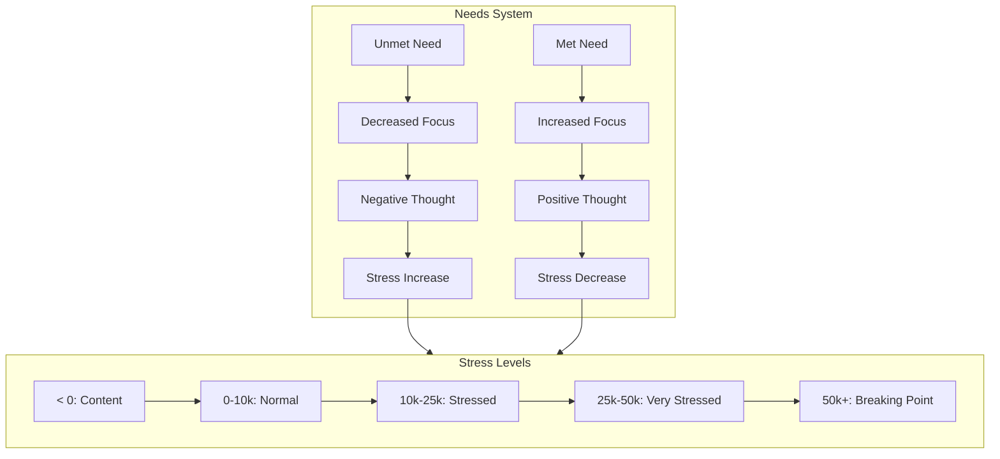

### Complete Needs List

| Need | Satisfaction Method | Related Trait |
|------|---------------------|---------------|
| Gregariousness | Socialize/speak | GREGARIOUSNESS |
| Drinking | Consume alcohol | IMMODERATION |
| Prayer/Meditation | Pray at temple | Religious beliefs |
| Occupation | Perform tasks | HARD_WORK |
| Creativity | Create art | ARTWORK |
| Excitement | Danger/performances | EXCITEMENT_SEEKING |
| Learning | Gain skill/read | KNOWLEDGE |
| Family | Socialize with family | FAMILY |
| Friendship | Socialize with friends | FRIENDSHIP |
| Martial Arts | Combat/sparring | MARTIAL_PROWESS |
| Romance | Interact with spouse | ROMANCE |
| Acquisition | Obtain items | GREED, COMMERCE |
| Good Meals | Eat preferred food | IMMODERATION |
| Fighting | Engage combat | VIOLENT |
| Helping | Aid others | ALTRUISM |

### Focus System

```mermaid
gantt
    title Focus Level Effects
    dateFormat X
    axisFormat %s

    section Performance
    Badly Distracted (-50% skill) :a, 0, 60
    Distracted (-25% skill)       :b, 60, 80
    Unfocused (-10% skill)        :c, 80, 100
    Normal (baseline)             :d, 100, 120
    Focused (+10% skill)          :e, 120, 140
    Very Focused (+50% skill)     :f, 140, 200
```

### Memory System


---

## 8. Combat & Anatomy System

### Body Part Hierarchy

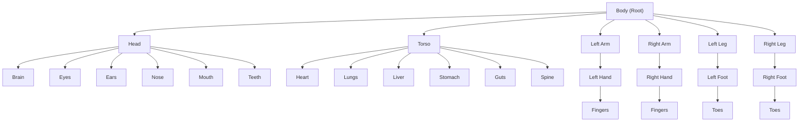

### Tissue Layer System

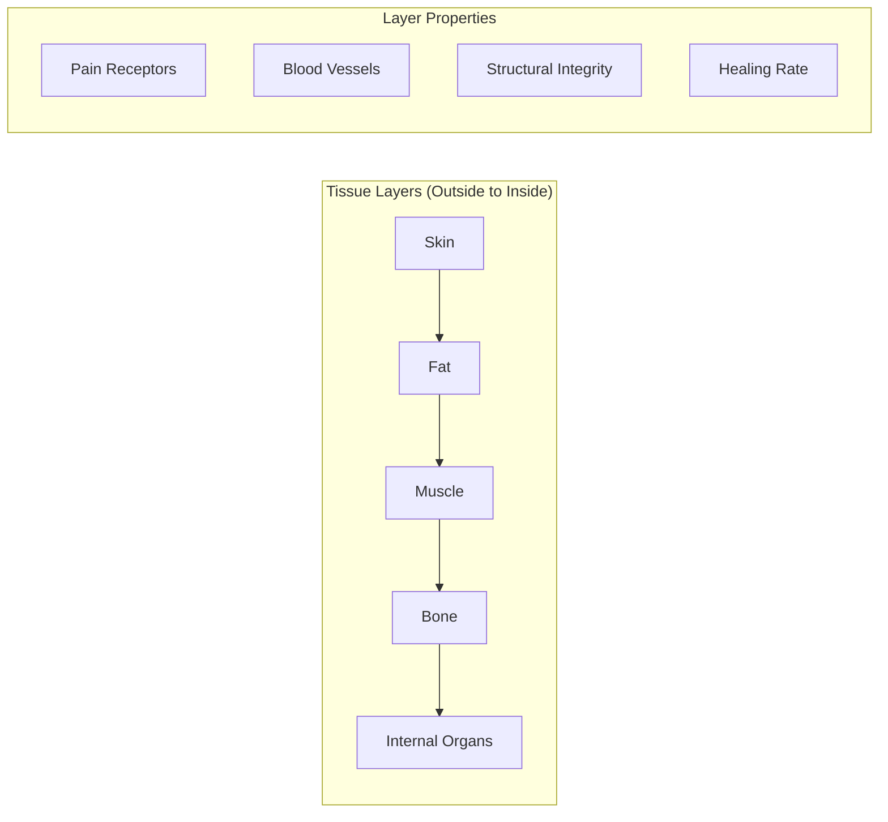

### Wound Severity Levels

| Level | Name | Description |
|-------|------|-------------|
| 0 | NONE | No active wounds |
| 1 | MINOR | Damage without functional consequences |
| 2 | INHIBITED | Partial loss of function |
| 3 | FUNCTION_LOSS | Complete function loss, structure intact |
| 4 | BROKEN | Lost structural integrity |
| 5 | MISSING | Part completely gone |

### Combat Flow

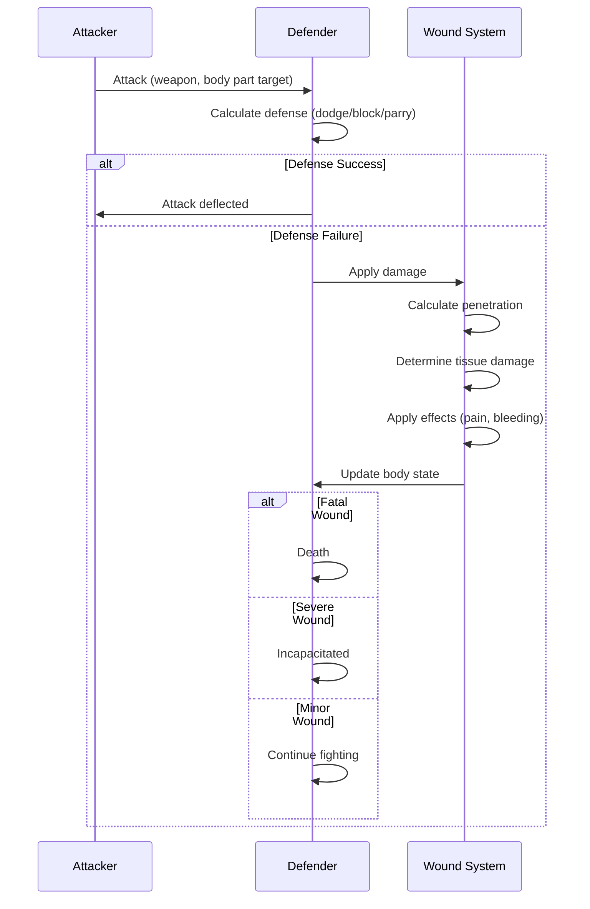

### Pain System

| Tissue Type | Pain Receptors | Effect |
|-------------|----------------|--------|
| Skin | 5 | Light pain |
| Fat | 5 | Light pain |
| Muscle | 5 | Light pain |
| Bone | 50 | Heavy pain |
| Organs | Variable | Heavy pain + effects |

**Pain Threshold:** 150+ points = unconsciousness

---

## 9. Item & Material System

### Item Quality Levels


### Item Hierarchy

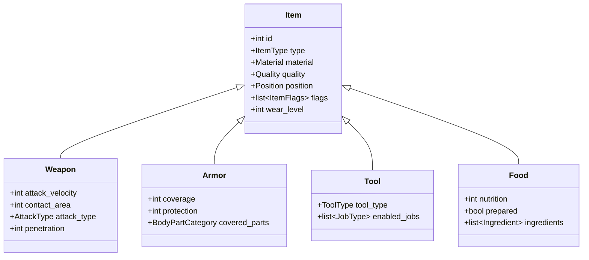

### Material Categories

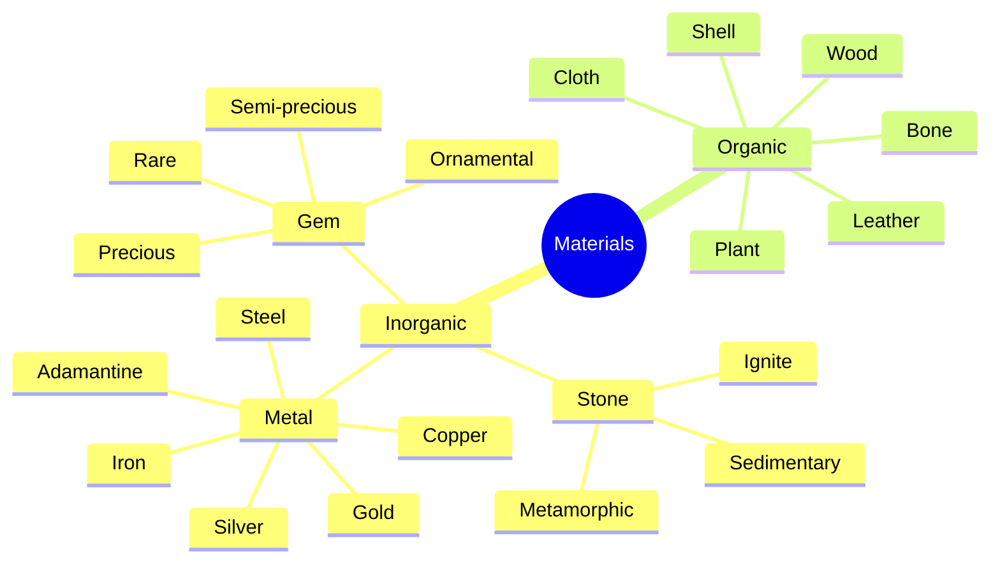

### Material Properties

| Property | Description |
|----------|-------------|
| SOLID_DENSITY | Weight per unit volume |
| IMPACT_YIELD | Blunt damage resistance |
| IMPACT_FRACTURE | Breaking point |
| SHEAR_YIELD | Cutting damage resistance |
| SHEAR_FRACTURE | Cutting breaking point |
| MELTING_POINT | Temperature to melt |
| VALUE | Base trade value |

---

## 10. Building & Construction System

### Building Types

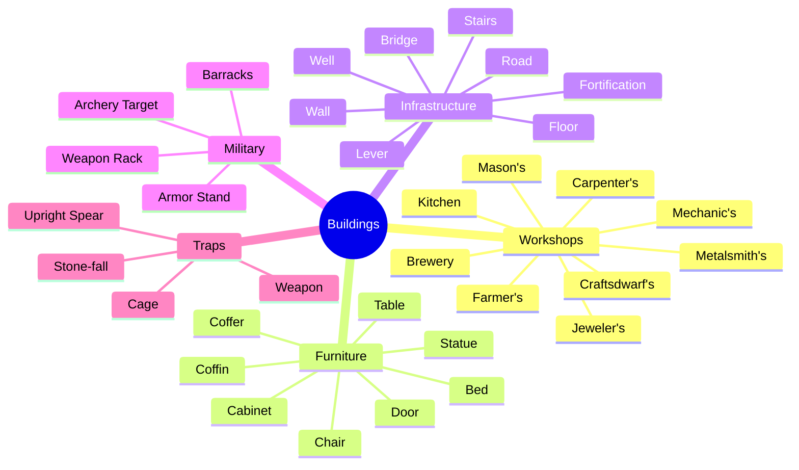

### Room System

```mermaid
erDiagram
    ROOM {
        int id
        enum room_type
        Position center
        int size
        Unit owner
        int value
    }

    FURNITURE {
        int id
        enum furniture_type
        Position position
        Quality quality
        Material material
    }

    ZONE {
        int id
        enum zone_type
        list positions
        list settings
    }

    STOCKPILE {
        int id
        list positions
        StockpileSettings settings
        int priority
    }

    ROOM ||--o{ FURNITURE : "contains"
    ZONE ||--o{ FURNITURE : "encompasses"
```

### Room Types & Requirements

| Room Type | Required Furniture | Max Size |
|-----------|-------------------|----------|
| Bedroom | Bed | 60×60 |
| Dining Room | Table + Chair | 60×60 |
| Office | Chair | 60×60 |
| Tomb | Coffin | 60×60 |
| Temple | None (zone) | 60×60 |
| Tavern | Table + Chair | 60×60 |
| Library | Bookcase | 60×60 |

---

## 11. Job & Task System

### Job Lifecycle

```mermaid
stateDiagram-v2
    [*] --> Created: job_generated
    Created --> Queued: added_to_queue
    Queued --> Assigned: dwarf_available
    Assigned --> InProgress: work_started
    InProgress --> Suspended: interrupted
    Suspended --> Queued: resumed
    InProgress --> Completed: work_done
    InProgress --> Failed: cannot_complete
    Completed --> [*]
    Failed --> [*]
```

### Job Priority System

| Priority | Value | Description |
|----------|-------|-------------|
| Highest | 1 | Do immediately |
| High | 2 | High priority |
| Above Normal | 3 | Above average |
| Normal | 4 | Default |
| Below Normal | 5 | Below average |
| Low | 6 | Low priority |
| Lowest | 7 | Do when idle |

### Work Order System

```mermaid
flowchart TD
    WO["Work Order Created"] --> Conditions{"Check Conditions"}

    Conditions -->|"Conditions Met"| Generate["Generate Jobs"]
    Conditions -->|"Conditions Not Met"| Wait["Wait for Conditions"]
    Wait --> Conditions

    Generate --> Assign["Assign to Workshop"]
    Assign --> Queue["Add to Job Queue"]
    Queue --> Execute["Execute Job"]
    Execute --> Complete["Job Complete"]
    Complete --> Check{"More Items Needed?"}
    Check -->|"Yes"| Generate
    Check -->|"No"| Done["Work Order Complete"]
```

---

## 12. Entity & Civilization System

### Entity Hierarchy

```mermaid
classDiagram
    class Entity {
        +int id
        +string name
        +EntityType type
        +list~Position~ positions
        +list~Unit~ members
        +list~Site~ sites
    }

    class Civilization {
        +Race race
        +Government government_type
        +list~Entity~ sub_entities
        +list~War~ wars
        +list~Treaty~ treaties
    }

    class SiteGovernment {
        +Site site
        +Entity parent_civ
        +list~Noble~ nobles
    }

    class Position {
        +string title
        +PositionLevel level
        +Unit holder
        +list~Responsibility~ responsibilities
        +list~Demand~ demands
    }

    Entity <|-- Civilization
    Entity <|-- SiteGovernment
    Entity "1" *-- "*" Position
```

### Noble Positions

#### Civilization-Level
- Monarch (King/Queen)
- General
- Diplomat
- Outpost Liaison

#### Site-Level
- Mayor (elected)
- Manager
- Broker
- Sheriff/Captain of the Guard
- Chief Medical Dwarf
- Bookkeeper

### Position Responsibilities

```mermaid
flowchart LR
    subgraph Utility["Utility Nobles"]
        Manager["Manager: Work Orders"]
        Broker["Broker: Trading"]
        Sheriff["Sheriff: Justice"]
        CMO["Chief Medical: Healthcare"]
        Bookkeeper["Bookkeeper: Stocks"]
    end

    subgraph Ceremonial["Ceremonial Nobles"]
        Mayor["Mayor: Morale"]
        Baron["Baron: Prestige"]
        Duke["Duke: Higher Prestige"]
    end
```

---

## 13. Pathfinding System

### A* Algorithm Implementation

```mermaid
flowchart TD
    Start["Start Position"] --> Open["Add to Open Set"]
    Open --> Eval{"Evaluate Lowest F-cost"}

    Eval --> Goal{"Is Goal?"}
    Goal -->|"Yes"| Path["Reconstruct Path"]
    Goal -->|"No"| Expand["Expand Neighbors"]

    Expand --> Check{"Check Each Neighbor"}
    Check --> Passable{"Is Passable?"}
    Passable -->|"No"| Check
    Passable -->|"Yes"| Calculate["Calculate G, H, F costs"]
    Calculate --> Update["Update Open/Closed Sets"]
    Update --> Eval

    Path --> Done["Return Path"]
```

### Traffic Designations

| Designation | Cost | Use Case |
|-------------|------|----------|
| High Traffic | 1 | Main hallways |
| Normal | 2 | Default |
| Low Traffic | 5 | Less preferred |
| Restricted | 25 | Emergencies only |

### Movement Costs

```mermaid
graph LR
    subgraph Terrain["Terrain Costs"]
        Floor["Floor: 1"] --> Stairs["Stairs: 2"]
        Stairs --> Ramp["Ramp: 2"]
        Ramp --> Water["Water: 5"]
        Water --> Magma["Magma: ∞"]
    end

    subgraph Modifiers["Cost Modifiers"]
        Door["Door: +1"]
        Furniture["Furniture: +1"]
        Traffic["Traffic Designation"]
    end
```

---

## Summary of Core Models

### Entity Summary

| Model | Key Properties | Relationships |
|-------|---------------|---------------|
| **Unit** | id, race, position, body, soul | Has body, soul, inventory, jobs |
| **Body** | parts, wounds, physical_attrs | Has body parts, wounds |
| **Soul** | mental_attrs, skills, personality | Has skills, needs, memories |
| **Item** | type, material, quality | Owned by unit, in position |
| **Building** | type, position, jobs | Contains items, generates jobs |
| **Job** | type, priority, assigned_unit | Assigned to unit, linked to building |
| **Entity** | type, members, positions | Has units, noble positions |
| **Tile** | position, terrain, temperature | Part of map |

### System Interactions

```mermaid
flowchart TB
    subgraph Core["Core Game Loop"]
        Update["Update Tick"]
    end

    subgraph Systems["System Updates"]
        Update --> Pathfinding
        Update --> Jobs
        Update --> Needs
        Update --> Combat
        Update --> Physics
    end

    subgraph Data["Data Changes"]
        Pathfinding --> UnitPosition["Unit Positions"]
        Jobs --> ItemState["Item States"]
        Needs --> UnitMood["Unit Moods"]
        Combat --> Wounds["Wounds/Deaths"]
        Physics --> FluidLevels["Fluid Levels"]
    end
```

---

## References

1. [Dwarf Fortress Wiki - Main](https://dwarffortresswiki.org/)
2. [DFHack df-structures](https://github.com/DFHack/df-structures)
3. [700,000 Lines of Code Article](https://stackoverflow.blog/2021/12/31/700000-lines-of-code-20-years-and-one-developer-how-dwarf-fortress-is-built/)
4. [Bay 12 Games](https://www.bay12games.com/dwarves/)
5. [DF Wiki - Attribute](https://dwarffortresswiki.org/index.php/DF2014:Attribute)
6. [DF Wiki - Personality Facet](https://dwarffortresswiki.org/index.php/DF2014:Personality_facet)
7. [DF Wiki - Need](https://dwarffortresswiki.org/index.php/DF2014:Need)
8. [DF Wiki - Stress](https://dwarffortresswiki.org/index.php/DF2014:Stress)
9. [DF Wiki - Combat](https://dwarffortresswiki.org/index.php/DF2014:Combat)
10. [DF Wiki - World Generation](https://dwarffortresswiki.org/index.php/DF2014:World_generation)
