# Runtime Loop & Decision Trees

This document details the primary runtime loop for each dwarf during each tick and the decision trees governing behavior, based on Dwarf Fortress mechanics research.

**Sources:**
- [DF Wiki - Time](https://dwarffortresswiki.org/index.php/DF2014:Time)
- [DF Wiki - Speed](https://dwarffortresswiki.org/index.php/v0.34:Speed)
- [DF Wiki - Thirst](https://dwarffortresswiki.org/index.php/DF2014:Thirst)
- [DF Wiki - Sleep](https://dwarffortresswiki.org/index.php/DF2014:Sleep)
- [DF Wiki - Labor](https://dwarffortresswiki.org/index.php/DF2014:Labor)

---

## Table of Contents

1. [Game Tick Architecture](#1-game-tick-architecture)
2. [Unit Update Loop](#2-unit-update-loop)
3. [Action Counter System](#3-action-counter-system)
4. [Need Thresholds & Counters](#4-need-thresholds--counters)
5. [Dwarf State Machine](#5-dwarf-state-machine)
6. [Decision Trees](#6-decision-trees)
7. [Job Assignment System](#7-job-assignment-system)
8. [Special Behaviors](#8-special-behaviors)

---

## 1. Game Tick Architecture

### Time Units

| Mode | 1 Tick = | Notes |
|------|----------|-------|
| Fortress Mode | 72 in-game seconds | 144x compression |
| Adventurer Mode | 0.5 in-game seconds | Real-time feel |

### Calendar Conversions (Fortress Mode)

```
1 tick    = 72 seconds
1 hour    = 50 ticks
1 day     = 1,200 ticks
1 month   = 33,600 ticks (28 days)
1 season  = 100,800 ticks (3 months)
1 year    = 403,200 ticks (12 months)
```

### Update Frequencies

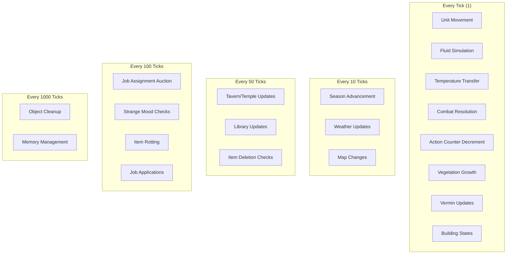

### Main Game Loop

```
MAIN_LOOP:
    for each tick:
        # Phase 1: World Updates
        update_fluids()
        update_temperature()
        update_weather()
        update_vegetation()

        # Phase 2: Unit Updates
        for each unit in active_units:
            unit.tick_update()

        # Phase 3: Building/Job Updates
        update_buildings()

        # Phase 4: Periodic Checks (staggered)
        if tick % 10 == 0:
            check_seasons()
        if tick % 50 == 0:
            update_social_locations()
        if tick % 100 == 0:
            run_job_auction()
            check_strange_moods()
        if tick % 1000 == 0:
            cleanup_objects()

        # Phase 5: Combat Resolution
        resolve_pending_combats()

        # Phase 6: Pathfinding Queue
        process_pathfinding_requests()
```

---

## 2. Unit Update Loop

### Per-Tick Unit Update

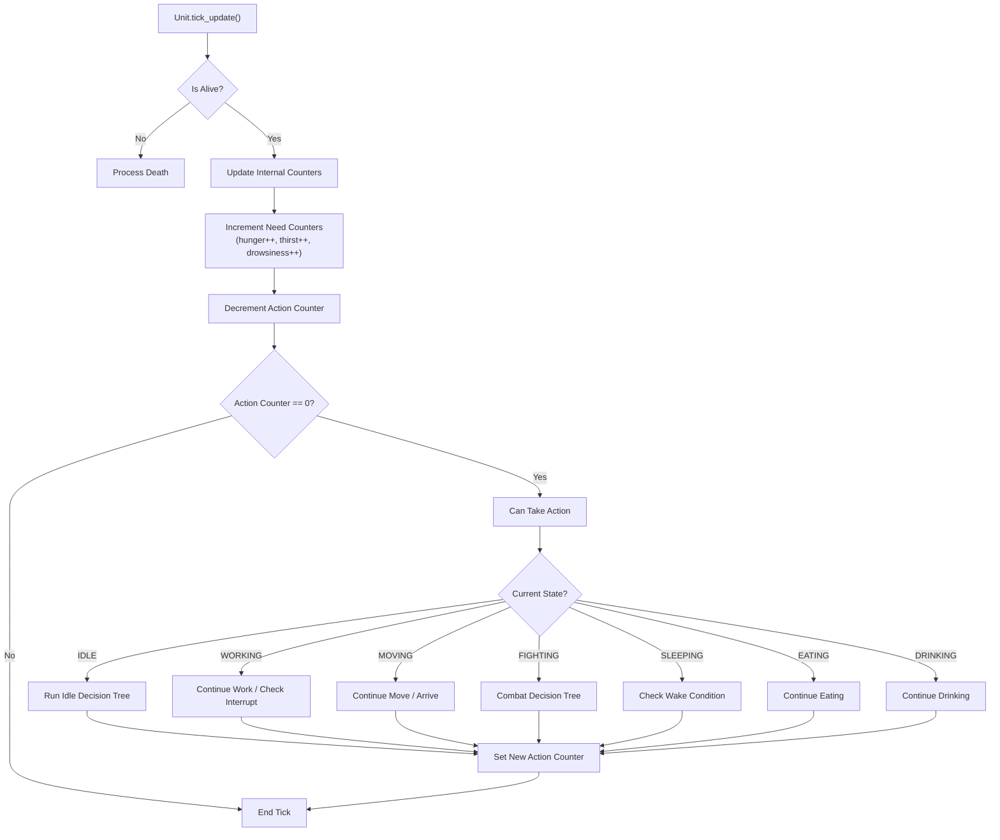

### Pseudocode: Unit Tick Update

```python
class Unit:
    def tick_update(self):
        if not self.is_alive:
            self.process_death()
            return

        # 1. Update internal counters
        self.hunger += 1
        self.thirst += 1
        self.drowsiness += 1

        # 2. Decrement action counter
        self.action_counter -= 1

        # 3. Check if can act this tick
        if self.action_counter > 0:
            return  # Still waiting

        # 4. Process current state
        match self.state:
            case State.IDLE:
                self.idle_decision_tree()
            case State.WORKING:
                self.work_update()
            case State.MOVING:
                self.movement_update()
            case State.FIGHTING:
                self.combat_update()
            case State.SLEEPING:
                self.sleep_update()
            case State.EATING:
                self.eat_update()
            case State.DRINKING:
                self.drink_update()

        # 5. Set next action counter based on speed
        self.action_counter = self.calculate_action_delay()
```

---

## 3. Action Counter System

### Speed Calculation

The speed system determines how many ticks pass between a unit's actions.

```
Base Speed: 900 (default for most creatures)
Higher number = SLOWER actions
```

### Action Delay Formula

```python
def calculate_action_delay(self) -> int:
    """
    Speed value determines delay between actions.
    - Hundreds digit: full turns to skip
    - Tens/ones: probability of extra turn

    Example: Speed 975
    - Skip 9 turns guaranteed
    - 75% chance to skip 10th turn
    """
    base_speed = self.race.base_speed  # e.g., 900

    # Apply modifiers
    effective_speed = base_speed
    effective_speed = self.apply_agility_modifier(effective_speed)
    effective_speed = self.apply_encumbrance_modifier(effective_speed)
    effective_speed = self.apply_status_modifiers(effective_speed)

    # Convert to delay
    full_turns = effective_speed // 100
    remainder = effective_speed % 100

    # Probabilistic extra delay
    if random.randint(1, 100) <= remainder:
        full_turns += 1

    return full_turns
```

### Speed Modifiers

| Modifier | Effect | Notes |
|----------|--------|-------|
| Agility | Multiplier on base speed | Higher = faster |
| Strength | Affects fast gaits | Running, sprinting |
| Encumbrance | Slows movement | Based on carry weight |
| Lying Down | ~50% slower | Knocked down |
| Stunned | ~50% slower | After heavy hit |
| Drowsiness | Progressive slowdown | Based on counter |
| Hunger | Progressive slowdown | After threshold |
| Thirst | Progressive slowdown | After threshold |
| Armor | Adds delay | Mitigated by skill |
| Sneaking | Adds delay | Mitigated by Ambusher |
| Swimming | Different speed | Mitigated by Swimmer |

### Movement Action Counter

```python
def start_movement(self, destination: Position):
    """Initialize movement to adjacent tile."""
    self.movement_target = destination
    self.state = State.MOVING

    # Base movement: 8 ticks per tile
    base_ticks = 8

    # Apply terrain modifiers
    terrain = self.world.get_terrain(destination)
    base_ticks *= terrain.movement_cost

    # Apply unit speed
    base_ticks = self.apply_speed_modifiers(base_ticks)

    self.action_counter = base_ticks
```

---

## 4. Need Thresholds & Counters

### Counter Increment Rate

All need counters increment by **1 per tick**.

```
Per day:    +1,200
Per month:  +33,600
Per year:   +403,200
```

### Thirst Thresholds

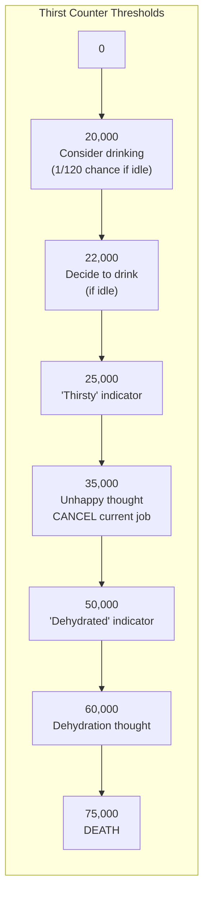

### Hunger Thresholds

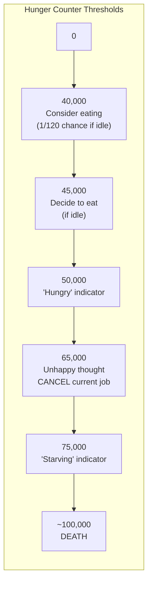

### Drowsiness Thresholds

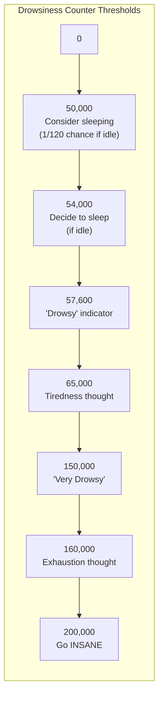

### Need Satisfaction

```python
NEED_SATISFACTION = {
    'thirst': -50_000,    # Completing drink
    'hunger': -50_000,    # Completing eat
    'drowsiness': -19,    # Per tick while sleeping
}

# Sleep recovery: ~2,650-2,900 ticks to fully recover
# (~5% of time spent sleeping)
```

### Need Check Decision

```python
def check_need_interrupt(self) -> Optional[NeedType]:
    """
    Check if a need is urgent enough to interrupt current activity.
    Returns the most urgent need or None.
    """
    # Critical thresholds that force job cancellation
    CRITICAL_THIRST = 35_000
    CRITICAL_HUNGER = 65_000
    CRITICAL_DROWSINESS = 150_000

    if self.thirst >= CRITICAL_THIRST:
        return NeedType.DRINK
    if self.hunger >= CRITICAL_HUNGER:
        return NeedType.EAT
    if self.drowsiness >= CRITICAL_DROWSINESS:
        return NeedType.SLEEP

    return None

def check_need_consideration(self) -> Optional[NeedType]:
    """
    Check if unit should consider satisfying a need (when idle).
    Uses probabilistic check for soft thresholds.
    """
    CONSIDER_THIRST = 20_000
    CONSIDER_HUNGER = 40_000
    CONSIDER_DROWSINESS = 50_000

    DECIDE_THIRST = 22_000
    DECIDE_HUNGER = 45_000
    DECIDE_DROWSINESS = 54_000

    # Hard decision thresholds
    if self.thirst >= DECIDE_THIRST:
        return NeedType.DRINK
    if self.hunger >= DECIDE_HUNGER:
        return NeedType.EAT
    if self.drowsiness >= DECIDE_DROWSINESS:
        return NeedType.SLEEP

    # Soft consideration (1/120 chance per tick)
    if random.randint(1, 120) == 1:
        if self.thirst >= CONSIDER_THIRST:
            return NeedType.DRINK
        if self.hunger >= CONSIDER_HUNGER:
            return NeedType.EAT
        if self.drowsiness >= CONSIDER_DROWSINESS:
            return NeedType.SLEEP

    return None
```

---

## 5. Dwarf State Machine

### Primary States

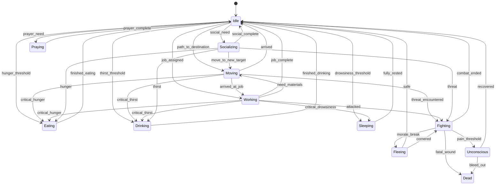

### State Priorities (Highest to Lowest)

```
1. DEAD / UNCONSCIOUS (terminal states)
2. FIGHTING (threat response)
3. FLEEING (survival)
4. CRITICAL_NEEDS (thirst > hunger > sleep)
5. MILITARY_ORDERS (if soldier on duty)
6. WORKING (assigned job)
7. SOFT_NEEDS (consider eating/drinking/sleeping)
8. SOCIALIZING / IDLE_ACTIVITIES
9. IDLE (no activity)
```

### State Transition Logic

```python
class UnitStateMachine:
    def evaluate_state_transition(self):
        """
        Evaluate if unit should transition to a new state.
        Called when action counter reaches 0.
        """
        # Priority 1: Check death/unconscious
        if self.health.is_dead:
            return State.DEAD
        if self.health.is_unconscious:
            return State.UNCONSCIOUS

        # Priority 2: Combat threat
        if self.has_hostile_in_range():
            return State.FIGHTING

        # Priority 3: Flee check (personality-based)
        if self.should_flee():
            return State.FLEEING

        # Priority 4: Critical needs (interrupt anything)
        critical_need = self.check_need_interrupt()
        if critical_need:
            return self.get_need_state(critical_need)

        # Priority 5: Military orders (if on duty)
        if self.is_military_on_duty():
            return self.evaluate_military_orders()

        # Priority 6: Continue current job
        if self.current_job and not self.current_job.is_complete:
            return State.WORKING

        # Priority 7: Soft needs (if idle)
        soft_need = self.check_need_consideration()
        if soft_need:
            return self.get_need_state(soft_need)

        # Priority 8: Social activities
        if self.should_socialize():
            return State.SOCIALIZING

        # Priority 9: Find new job or idle
        return State.IDLE
```

---

## 6. Decision Trees

### Master Idle Decision Tree

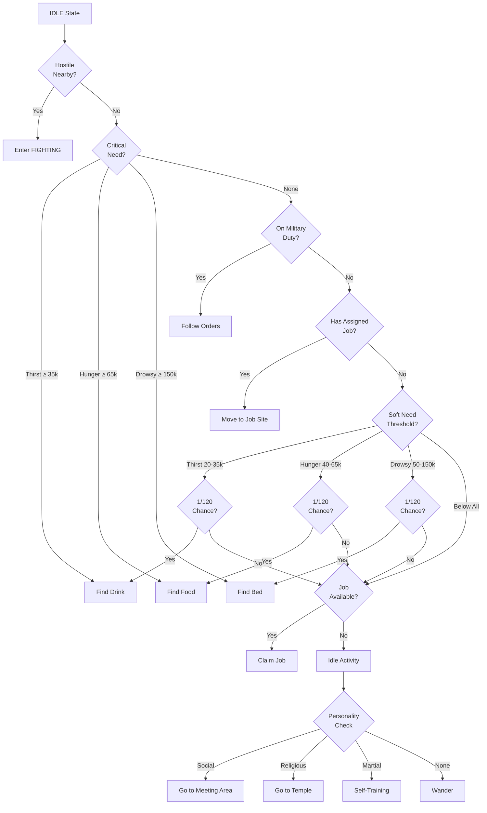

### Job Selection Decision Tree

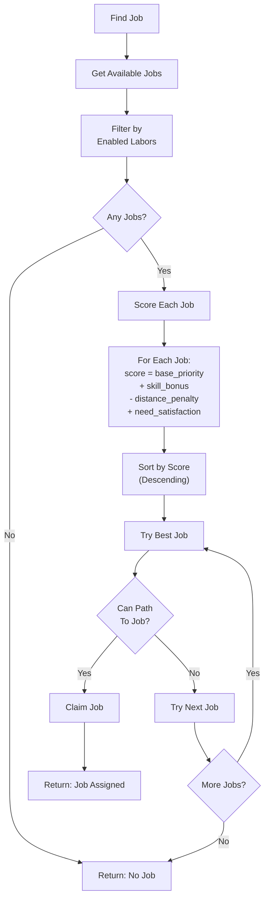

### Combat Decision Tree

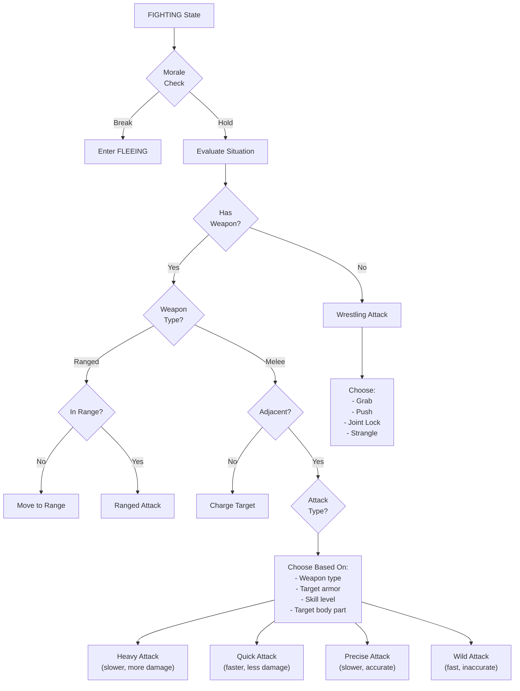

### Need Satisfaction Decision Tree

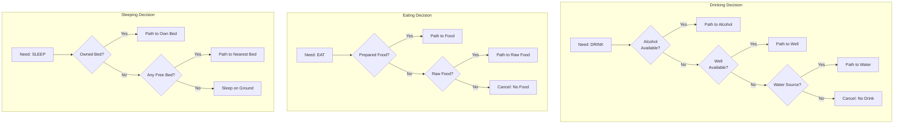

---

## 7. Job Assignment System

### Job Auction (Every 100 Ticks)

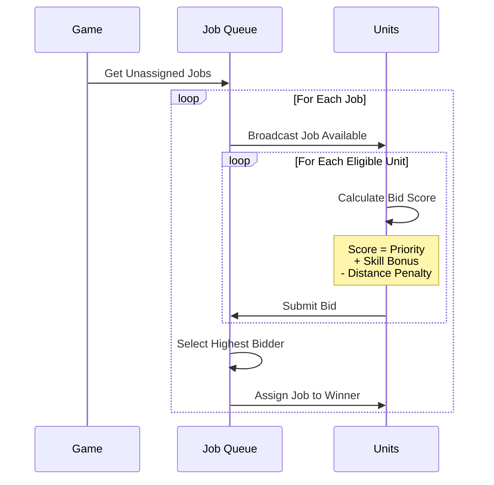

### Job Scoring Formula

```python
def calculate_job_score(self, job: Job) -> float:
    """
    Calculate a score for job assignment priority.
    Higher score = more likely to be assigned.
    """
    score = 0.0

    # Base priority (1-7, inverted so 1 is best)
    score += (8 - job.priority) * 100

    # Skill bonus
    if job.required_skill:
        skill_level = self.get_skill_level(job.required_skill)
        score += skill_level * 10

    # Distance penalty
    distance = self.position.distance_to(job.position)
    score -= distance * 2

    # Workshop assignment bonus
    if job.workshop and job.workshop.is_assigned_to(self):
        score += 50

    # Need satisfaction bonus
    if job.satisfies_need:
        need_level = self.get_need_level(job.satisfies_need)
        score += need_level / 1000

    return score
```

### Job Lifecycle

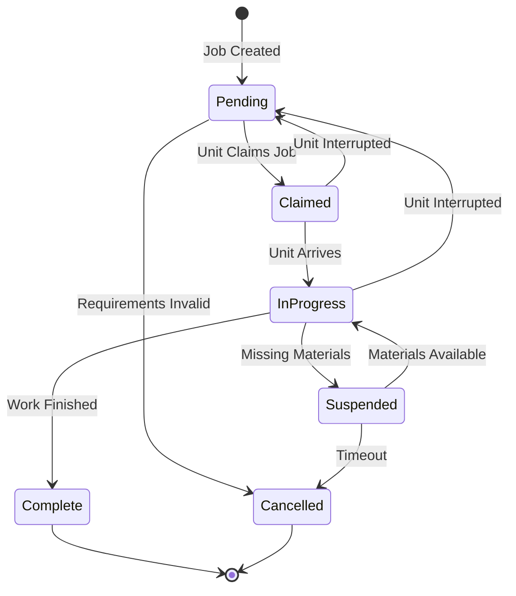

---

## 8. Special Behaviors

### Strange Mood Trigger

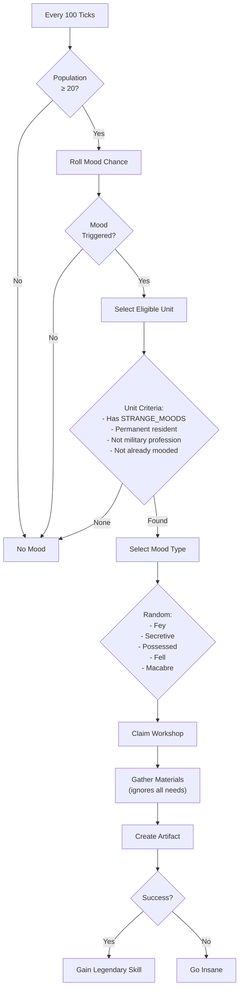

### Military Schedule State

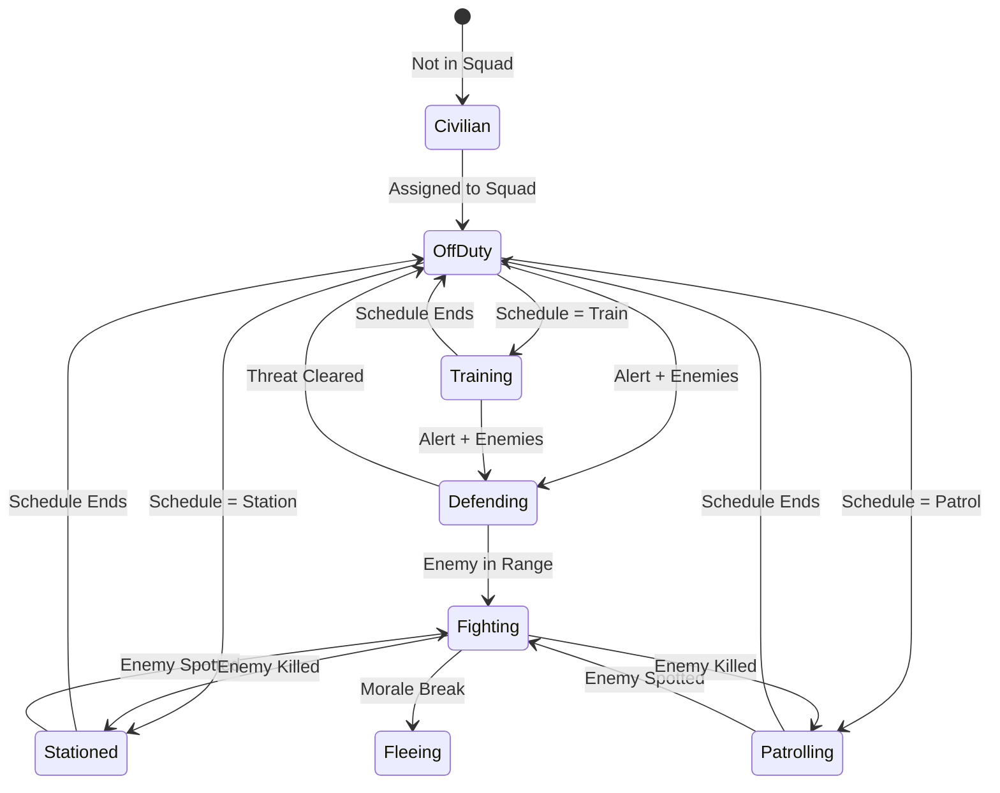

### Break/Idle Activity Selection

```python
def select_idle_activity(self) -> IdleActivity:
    """
    Select an idle activity based on personality and needs.
    """
    activities = []

    # Check social need
    if self.needs.gregariousness > 0:
        activities.append((
            IdleActivity.SOCIALIZE,
            self.personality.get_facet(Facet.GREGARIOUSNESS)
        ))

    # Check religious need
    for deity in self.worshipped_deities:
        if self.needs.prayer[deity] > 0:
            activities.append((
                IdleActivity.PRAY,
                self.personality.get_belief_strength(Belief.TRADITION)
            ))

    # Check martial training (if disciplined soldier)
    if self.is_military and self.personality.get_facet(Facet.DUTIFULNESS) > 60:
        activities.append((
            IdleActivity.SELF_TRAIN,
            self.personality.get_facet(Facet.PERSEVERANCE)
        ))

    # Check art appreciation
    if self.personality.get_facet(Facet.ART_INCLINED) > 50:
        activities.append((
            IdleActivity.APPRECIATE_ART,
            self.personality.get_facet(Facet.ART_INCLINED)
        ))

    # Check nature need
    if self.personality.get_belief_strength(Belief.NATURE) > 0:
        activities.append((
            IdleActivity.WANDER_OUTSIDE,
            self.personality.get_belief_strength(Belief.NATURE)
        ))

    # Default: wander
    if not activities:
        return IdleActivity.WANDER

    # Weighted random selection
    total = sum(weight for _, weight in activities)
    roll = random.randint(1, total)

    cumulative = 0
    for activity, weight in activities:
        cumulative += weight
        if roll <= cumulative:
            return activity

    return IdleActivity.WANDER
```

---

## Summary: Complete Tick Processing

```python
def process_unit_tick(unit: Unit):
    """
    Complete tick processing for a single unit.
    """
    # 1. Skip if dead
    if unit.is_dead:
        return

    # 2. Increment need counters
    unit.hunger += 1
    unit.thirst += 1
    unit.drowsiness += 1

    # 3. Process any active syndromes/effects
    for syndrome in unit.active_syndromes:
        syndrome.tick(unit)

    # 4. Decrement action counter
    unit.action_counter -= 1

    # 5. If can't act yet, return
    if unit.action_counter > 0:
        return

    # 6. State-specific update
    match unit.state:
        case State.IDLE:
            # Run full decision tree
            new_state = unit.idle_decision_tree()
            unit.transition_to(new_state)

        case State.MOVING:
            if unit.has_arrived():
                unit.arrive_at_destination()
            else:
                unit.continue_movement()

        case State.WORKING:
            # Check for interrupts
            interrupt = unit.check_need_interrupt()
            if interrupt:
                unit.suspend_job()
                unit.transition_to(interrupt.get_state())
            elif unit.has_hostile_nearby():
                unit.suspend_job()
                unit.transition_to(State.FIGHTING)
            else:
                unit.continue_work()

        case State.FIGHTING:
            unit.combat_decision_tree()

        case State.SLEEPING:
            unit.drowsiness -= 19  # Recovery rate
            if unit.drowsiness <= 0:
                unit.drowsiness = 0
                unit.transition_to(State.IDLE)

        case State.EATING:
            if unit.eating_progress >= 100:
                unit.hunger -= 50_000
                unit.hunger = max(0, unit.hunger)
                unit.transition_to(State.IDLE)
            else:
                unit.eating_progress += unit.get_eating_speed()

        case State.DRINKING:
            if unit.drinking_progress >= 100:
                unit.thirst -= 50_000
                unit.thirst = max(0, unit.thirst)
                unit.transition_to(State.IDLE)
            else:
                unit.drinking_progress += unit.get_drinking_speed()

    # 7. Set next action delay
    unit.action_counter = unit.calculate_action_delay()
```

---

## Constants Reference

### Need Thresholds

```python
class NeedThresholds:
    # Thirst
    THIRST_CONSIDER = 20_000
    THIRST_DECIDE = 22_000
    THIRST_INDICATOR = 25_000
    THIRST_CRITICAL = 35_000
    THIRST_DEHYDRATED = 50_000
    THIRST_DEATH = 75_000

    # Hunger
    HUNGER_CONSIDER = 40_000
    HUNGER_DECIDE = 45_000
    HUNGER_INDICATOR = 50_000
    HUNGER_CRITICAL = 65_000
    HUNGER_STARVING = 75_000
    HUNGER_DEATH = 100_000

    # Drowsiness
    DROWSY_CONSIDER = 50_000
    DROWSY_DECIDE = 54_000
    DROWSY_INDICATOR = 57_600
    DROWSY_TIRED_THOUGHT = 65_000
    DROWSY_VERY = 150_000
    DROWSY_EXHAUSTED = 160_000
    DROWSY_INSANE = 200_000

    # Satisfaction amounts
    DRINK_SATISFACTION = 50_000
    EAT_SATISFACTION = 50_000
    SLEEP_RECOVERY_PER_TICK = 19
```

### Speed Constants

```python
class SpeedConstants:
    DEFAULT_SPEED = 900
    MOVEMENT_BASE_TICKS = 8
    CONSIDERATION_CHANCE = 120  # 1 in 120 per tick

    # Terrain costs
    TERRAIN_FLOOR = 1.0
    TERRAIN_STAIRS = 2.0
    TERRAIN_WATER = 5.0
    TERRAIN_DIFFICULT = 3.0
```

### Update Frequencies

```python
class UpdateFrequency:
    EVERY_TICK = 1
    WEATHER = 10
    SOCIAL_ZONES = 50
    JOB_AUCTION = 100
    STRANGE_MOOD_CHECK = 100
    OBJECT_CLEANUP = 1000
```
